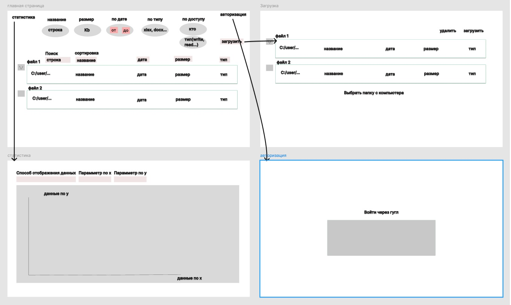

# Тема курсовой
## Сервис обёртка вокруг Google Drive API, упрощающий произведение массовых манипуляций с файлами и сбор/анализ статистики

Многостраничный сайт:

- [ ] главная страница:
  - [ ] страница с отображением всех файлов
  - [ ] поиском
  - [ ] сортировкой (дата изменения, тип файла, название)
  - [ ] фильтрацией (тип файла, дата изменения/создания от и до, наличие доступа у пользователей, типу доступа, размеру)
  - [ ] для массово выбранных файлов доступно удаление

- [ ] страница массового импорта/экспорта - позволяет скачать всё или массово загрузить некоторый набор файлов

- [ ] страница со статистикой
  - позволяет выбрать 2 параметра, которые будут отложены по осям (например тип файла и размер) и далее будет строиться визуальное отображение данных (предполагается график или столбчатая диаграмма, в зависимости от дискретности данных параметров, которые будут выбраны) (для данного примера столбчатая диаграмма, тк тип файла - дискретный параметр)

- [ ] Как обговорили в предыдущих письмах, авторизация (через гугл аккаунт) на данный момент не делается, реализуется работа с открытой на чтение папкой

## Use-case

## Предварительная проверка заданий

 

